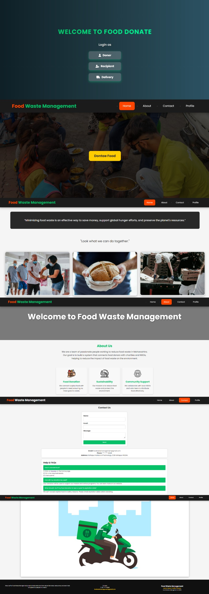
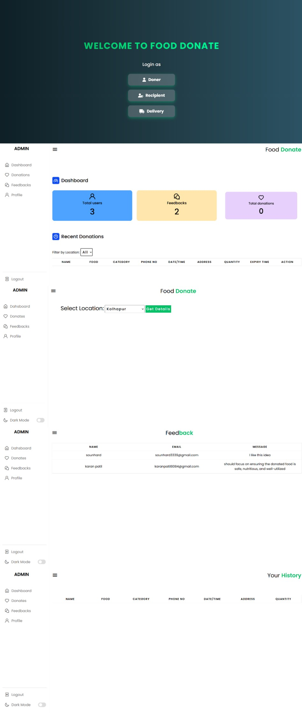

# 🍽️ Food Waste Management System

## 📖 Project Overview
The **Food Waste Management System** is a web-based platform designed to collect excess or leftover food from donors such as **restaurants, hotels, marriage halls, and individuals**, and distribute it to **needy people** through NGOs and delivery volunteers.

This system helps reduce food waste while ensuring that surplus food reaches those who need it most.

---

## 🧰 Tools & Technologies Used

| Component | Technology |
|------------|-------------|
| **Frontend** | HTML, CSS, JavaScript |
| **Backend** | PHP |
| **Web Server** | XAMPP |
| **Database** | MySQL |

---

## 🧩 System Modules

### 👤 User Module
- Designed for people who wish to donate their excess or leftover food.
- Users can register, log in, and donate food.
- Allows users to specify the type and quantity of food and their location.
- Tracks all past donations made by the user.

### 🧑‍💼 Admin Module
- Managed by registered NGOs, trusts, or charity organizations.
- Receives donation information from users.
- Allows NGOs to choose available donations and assign delivery persons.
- Tracks which organizations have collected which donations.

### 🚚 Delivery Module
- For volunteers providing pickup and drop services.
- Delivery personnel can register and log in.
- Displays pickup and drop-off locations.
- Helps NGOs manage deliveries efficiently.

---

## ✨ Features
- 🔐 **Secure Login with Password Hashing**
- 🍱 **Efficient Food Donation Management**
- 👨‍💻 **Role-based Access (User, Admin, Delivery)**
- 🗄️ **Database Integration with MySQL**
- 🌍 **Community-driven platform to reduce food waste**

---

## 🖼️ Screenshots

### 🧍‍♂️ Doner/User Module


### 🧑‍💼 Admin/Recipient Dashboard


### 🚚 Delivery Module


### 📱 Responsive Website


---


## ⚙️ How to Run the Project Locally

1. **Download or Clone the Repository**
   ```bash
   git clone https://github.com/Sounhard/Food-Waste-Management-System.git
   
2. **Move the folder to your XAMPP htdocs directory
      C:\xampp\htdocs\Food-Waste-Management-System

3. **Start Apache and MySQL from your XAMPP Control Panel.

4. **Open phpMyAdmin
    http://localhost/phpmyadmin


5. **Create a new database
   Example name: foodwaste_db

6. **Import the SQL file
    Navigate to the database folder inside your project.
    Import demo.sql into your new database.

7. **Run the project
    http://localhost/Food-Waste-Management-System


8. **Login and Explore
    Register as a new user, admin, or delivery person.
    Donate or assign food donations.


****💡 Future Enhancements

✅ Email notifications for new donations and deliveries

✅ Google Maps API for location tracking

✅ Real-time delivery status updates

✅ Admin analytics dashboard for better management

✅ AI-based food quality prediction system (future scope)


👨‍💻 Developed By

🧑‍💼Sounhard Powar
🎓 B.Tech in Computer Science & Engineering

